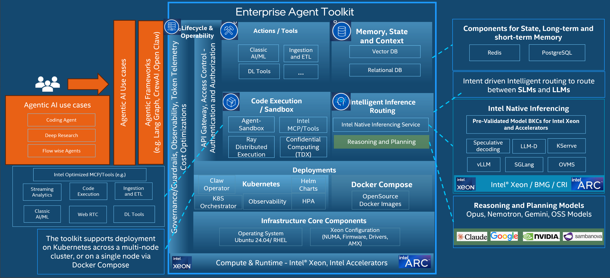

# Intel® AI for Enterprise Agent Toolkit

A batteries‑included agentic AI stack optimized for Intel® Xeon, delivering ready‑to‑deploy components for memory, sandboxing, tools, orchestration, and governance.

This repo gives one-click deployment of a Agentic AI platform.

Deploys a full Kubernetes-based stack with GenAI Gateway (LiteLLM + Langfuse), observability (Prometheus + Grafana), Redis (shared memory backend), PostgreSQL + pgvector (vector store), and the user-selected SLM or LLM model for Intel® Xeon or Intel® AI Accelerator.

---

## Table of Contents

- [What is the Intel® AI for Enterprise Agent Toolkit?](#what-is-the-intel-ai-for-enterprise-agent-toolkit)
- [Platform Capabilities](#platform-capabilities)
- [Prerequisites](docs/prerequisites.md)
- [Quick Start](docs/quick-start.md)
- [Decommission / Reset and Redeploy](docs/decommission-and-redeploy.md)
- [License](#license)

---

## What is the Intel® AI for Enterprise Agent Toolkit?

The Intel® AI for Enterprise Agent Toolkit is a production-ready, Kubernetes-based platform that turns single or multi server into a fully operational AI agent infrastructure. It bundles every layer an enterprise needs to build, run, and govern AI agents — from secure API routing and intelligent model dispatch, to sandboxed code execution, persistent agent memory, and real-time observability.

Built on Intel® Xeon® Scalable processors (and optionally Intel® AI Accelerators), the stack is optimized for CPU-efficient inference out of the box and is designed to grow: models on external GPU clusters can be added to the same gateway at any time.

### Architecture Flow Diagram

---

## Platform Capabilities

### API Gateway & Access Control
Unified, secure API entry point with policy-driven routing, rate limiting, and enterprise-grade authentication and authorization for agents, tools, and applications. Powered by **LiteLLM** (OpenAI-compatible gateway) every request is authenticated and governed before it reaches a model or tool.

### Intelligent Routing
Automatically routes inference workloads to CPUs or GPUs based on the intent of the request — reasoning and planning tasks stay on in-cluster CPU nodes, while heavy compute (encoders, large generation) can be forwarded to external GPU clusters. The routing layer is model-agnostic and supports any OpenAI-compatible backend.

### Actions & Sandbox
Enables safe agent actions through sandboxed code execution, tool isolation, token telemetry, and policy-driven governance to control blast radius and ensure enterprise compliance. The **Agent Sandbox** controller ([kubernetes-sigs/agent-sandbox](https://github.com/kubernetes-sigs/agent-sandbox)) provides isolated, ephemeral Kubernetes pod environments — each sandbox is a fully self-contained pod with its own filesystem and process tree.

### Memory, State & Context
Provides scalable short- and long-term agent memory using vector databases and relational stores to maintain context across tasks, sessions, and workflows. **Redis** (with RediSearch) is deployed as the default memory backend, giving agents persistent session state, semantic search over past interactions, and cross-request continuity.

### Intel Tools & MCP
Accelerates agent actions via Intel-optimized tools, **Model Context Protocol (MCP)** integrations, classic AI/ML pipelines and ingestion/ETL services. MCP server templates are included for extending the agent with domain-specific tooling without modifying the core stack.

### Orchestration
Orchestrates all agent workloads with **Kubernetes** (via Kubespray), **Helm**, and an Ansible-based automation layer. The stack supports distributed execution, rolling updates, high-availability scaling, and multi-node expansion out of the box.

### Observability & Telemetry
Integrates seamlessly with enterprise monitoring tooling, providing real-time metrics, traces, and logs through **Prometheus**, **Grafana**, **Loki**, and **Langfuse** (LLM-native tracing). Every token, latency measurement, and agent step is captured and queryable from the included dashboards.

---

## Prerequisites

Hardware requirements, SSH key setup, and DNS/TLS configuration are covered in **[Prerequisites Guide](docs/prerequisites.md)**.

---

## Quick Start

The full step-by-step deployment guide — covering the base stack, semantic routing, Redis, pgvector, and Agent Sandbox — is in **[Quick Start Guide](docs/quick-start.md)**.

---

## Decommission / Reset and Redeploy from Scratch

To tear down the cluster and redeploy from scratch, see **[Decommission and Redeploy Guide](docs/decommission-and-redeploy.md)**.

---

## License

Licensed under the [Apache License Version 2.0](LICENSE).

## Security

The [Security Policy](SECURITY.md) outlines our guidelines and procedures for ensuring the highest level of security and trust for our users who consume Intel® AI for Enterprise Agent Toolkit.

## Trademark Information

Intel, the Intel logo, Xeon are trademarks of Intel Corporation or its subsidiaries.

Other names and brands may be claimed as the property of others.

&copy; Intel Corporation
